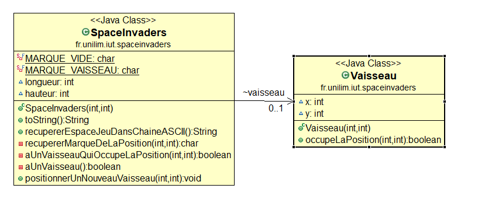
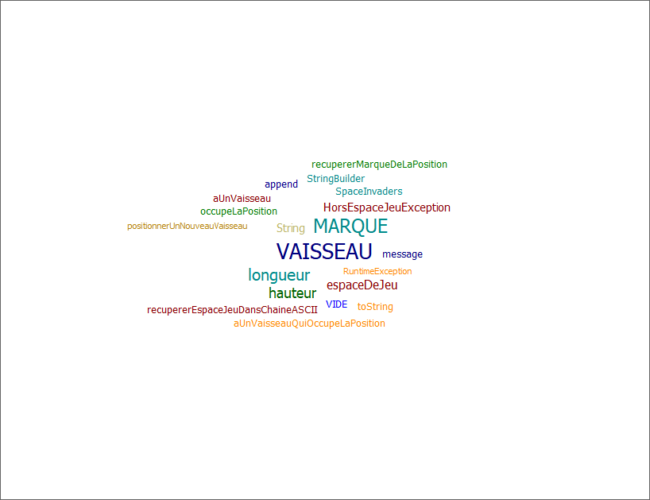
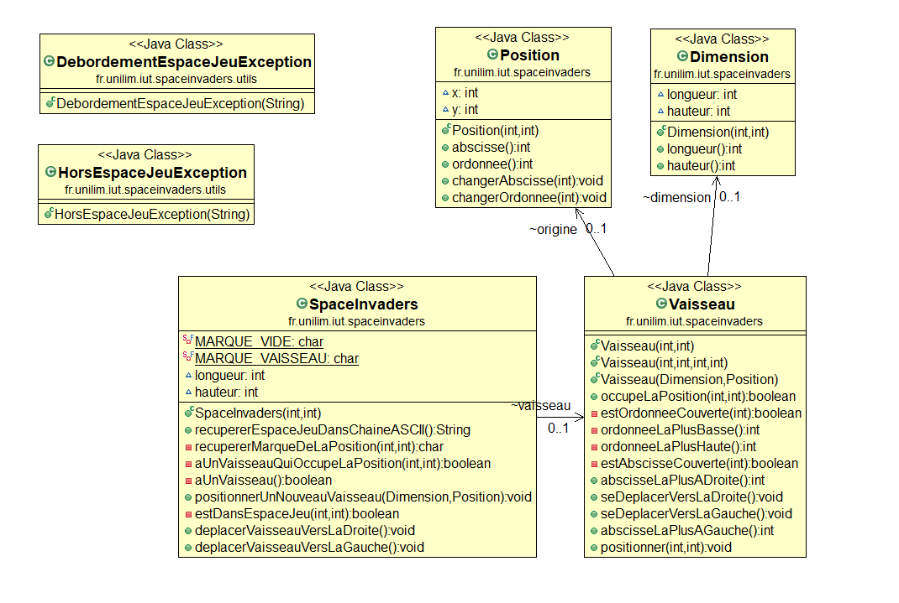
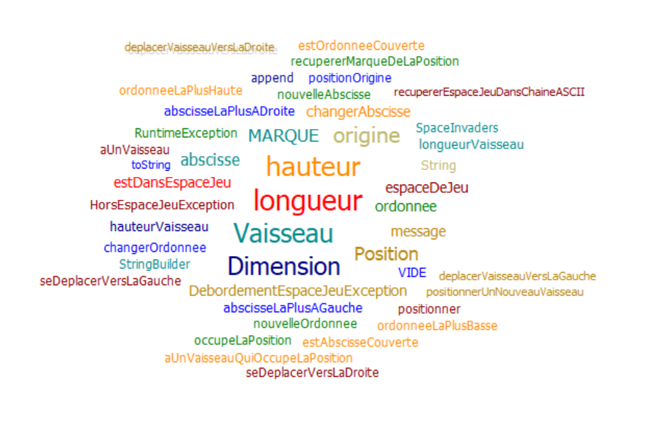
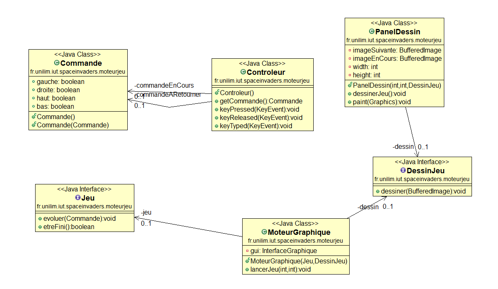
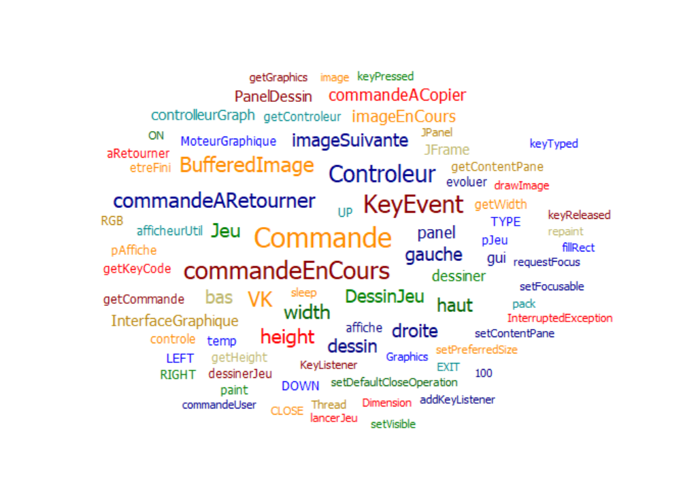
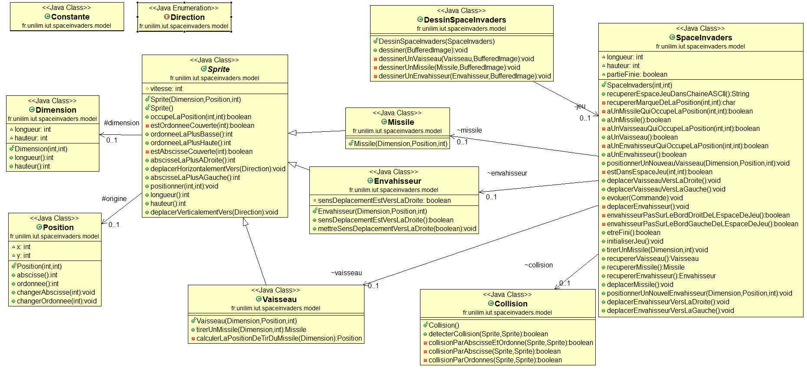
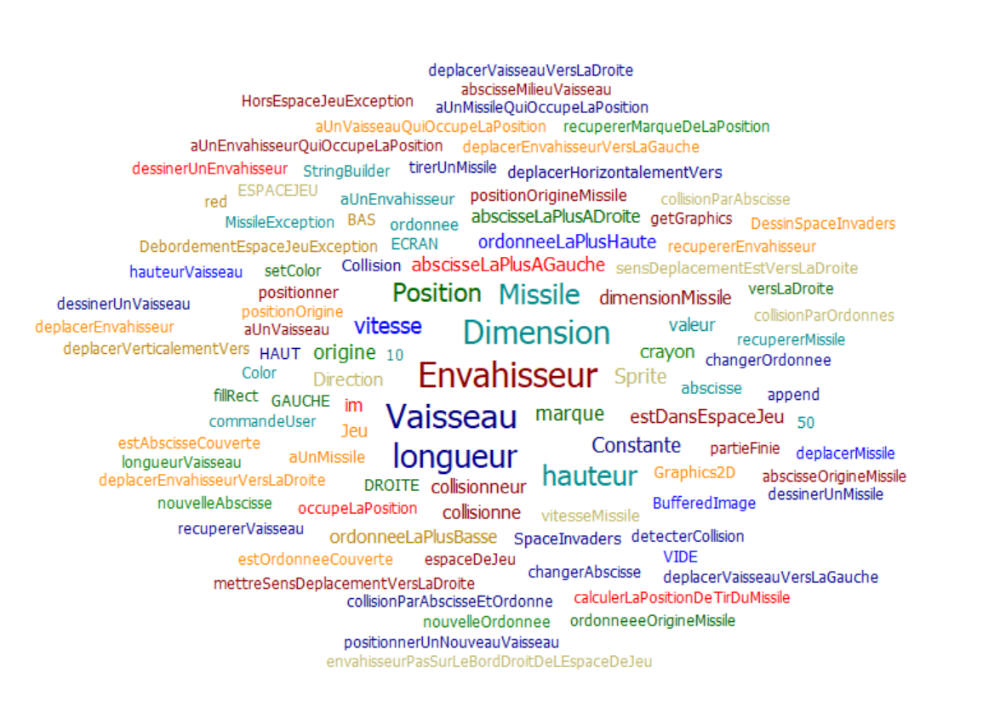

# Projet SpaceInvaders M2105

## Sommaire
- [Semaine n°2 : du 26 avril au 2 mai](#semaine2)
- [Semaine n°3 : du 3 au 9 mai](#semaine3)
- [Semaine n°4 : du 10 au 16 mai](#semaine4)
- [Semaine n°5 : du 17 au 23 mai](#semaine5) 
- [Semaine n°6 : du 24 au 30 mai](#semaine6) 

## Semaine n°2 : du 26 avril au 2 mai <a id='semaine2'> <a/>
### Sprints et fonctionnalités réalisées 
#### Fonctionnalité 1 (en cours)
- Story n°1 : Créer un espace de jeu
Un espace de jeu est créé aux dimensions données (2D) Cet espace de jeu est vide
- Story n°2 : Positionner un nouveau vaisseau dans l’espace de jeu
Un nouveau vaisseau est créé Le vaisseau est positionné aux coordonnées transmises Si un nouveau vaisseau essaye d’être positionné en dehors des limites de l’espace jeu, alors une exception devra être levée. Contraintes : La position souhaitée est transmise par ses coordonnées x et y. Le coin supérieur gauche de l’espace jeu (point en haut à gauche) a pour coordonnées (0,0) La taille du vaisseau est réduite pour l'instant à son minimum (1 seul point)

### Diagramme de classe

### Nuage de mots

## Semaine n°3 : du 3 au 9 mai <a id='semaine3'> <a/>

Cette semaine le projet n'a pas avancé

## Semaine n°4 : du 10 au 16 mai <a id='semaine4'> <a/>
### Sprints et fonctionnalités réalisées 
#### Fonctionnalité 1 
- Story n°3 : Déplacer le vaisseau vers la droite dans l'espace de jeu
Le vaisseau peut maintenant se deplacer vers la droite. Lorsque celui-ci est sur le bord, il est immobile si est censé se deplacer sur la droite
- Story n°4 : Déplacer le vaisseau vers la gauche dans l'espace de jeu
- Le vaisseau peut maintenant se deplacer vers la gauche. Lorsque celui-ci est sur le bord, il est immobile si est censé se deplacer sur la gauche

#### Fonctionnalité 2
- Etape n°1 : Positionner un nouveau vaisseau avec une dimension donnée
Le vaiseau peut maintanant être positionné ou on le veux. De plus nous avons mis en place beaucoup de refactoring afin que le code soit bien lisible
- Etape n°2 : Faire en sorte qu'il soit impossible de positionner un nouveau vaisseau qui déborde de l'espace de jeu
Ici on a géré deux potentielle "erreur" afin que le vaisseau soit toujours bien positionné. Nous avons vu en effet que nous avions que 2 cas a tester :
  - un test pour une longueur trop grande qui provoque un débordement sur la droite (celui de l'exemple n°1)
  - un test pour une hauteur trop grande qui provoque un débordement vers le haut (celui de l'exemple n°2)
- Etape n°3 : Déplacer un vaisseau vers la droite en tenant compte de sa dimension
Nous pouvons maintenant deplacer le vaisseau vers la droite en tenant compte des dimensions. Nous avons remarqué que les tests étais déjà au vert, nous avons donc juste fait un peu de refactoring
- Etape n°4 : Déplacer un vaisseau vers la gauche en tenant compte de sa dimension
Tout comme ^récédemment, nous pouvons faire de même vers la gauche, et les test étais au vert. 
En therme de refactoring nous avons notemment crée deux nouvelle classe : dimention et posistion afin que notre code soit plus lisible dans le temps. Toutes les classes ont ainsi subi des modifications allant dans se sens

### Diagramme de classe

### Nuage de mots

## Semaine n°5 : du 17 au 23 mai <a id='semaine5'> <a/>
### Sprints et fonctionnalités réalisées 
#### Spike : Prise en main et intégration d'un moteur graphique
- Dans un premier temps il a fallu comprendre le fonctionnement du moteur graphique utilisé. L'auteur de se script est Vincent Thomas, professeur a l'IUT Informatique de Reims.  J'ai donc commencé par tester le moteur graphique, lu la documentation et essayer de changer les touches "q" et "d" par les fleches.
- Une fois le script compris, nous l'avons utilisé afin de l'intégrer à notre projet puis l'adapter afin qu'il respect les règles que nous avions déjà fixé. Notemment un vaisseau peut se déplacer seulement vers la droite et la gauche. Celui-ci ne peut pas non plus dépasser de la fenetre de jeu. 

### Diagramme de classe du moteur

### Nuage de mots du moteur

  
## Semaine n°5 : du  17 au 23 mai <a id='semaine5'> <a/>
 
Cette semaine le projet n'as pas avancé
  
## Semaine n°6 : du 24 au 30 mai <a id='semaine6'> <a/>
### Sprints et fonctionnalités réalisées
#### Fonctionnalité 3 
- Etape 1 : Ajouter la vitesse au Vaisseau sans régression de comportement
Introduction de la variable vitesse dans la classe vaisseau. Pour l'intégrer à notre code, on a modifié dans les methodes "seDeplacerVersLaDroite" et "seDeplacerVersLaGauche" l'attribue vitesse a la place du 1. En effet, modifié cette vitesse nous permet de changer notre abscisse plus ou moins vite...
- Etape 2 : Régler la vitesse du vaisseau
Pour faire ceci il nous suffit d'instancier une vitesse dans un des constructeurs du vaisseau, et de re,ntrer une valeur de basse dans un autre.
- Etape 3 : Faire en sorte que le déplacement se fasse correctement pour une vitesse quelconque
C'est ici que la plupart des tests ont été fait. Il faut vériufié tout les cas de déplacement vers laz gauche est vers la droite. Notamment si il avance normalement ou si il vient a rencontrer un bord (celui-ci ne doit pas déborder). 
- Etape 4 : Mise a jour du moteur graphique
Ici rien de birn compliqué. Une constante vitesse a été ajouter au vaisseau dans "initialiserJeu". Elle est bien sur déclarer dans la classe constante. Puis nous avons tester quel vitesse étais le plus approprié.
  
#### Fonctionnalité 4
- Etape 1 : Création d'un "srite"
Dans cette étape nous vons choisi de refactorer un peu le code afin de défionir une supoer classe : "Sprite". C'est la super classe de vaisseau, et bientot missile...
Quelques modifications dans la classe vaisseau ont été apporté afin d'y garder seulement un constructeur afin que chaque sprite puisse se deplacer.
- Etape 2 : Tirer un missile en TDD
Dans cettte étape nous avons crée une nouvelle methode "tirerUnMissile" qui nous sert enfaite à créer le missile. Plusieurs tests ont donc été fait en fonction de la longueur du missile et du vaisseau. Par exemple, si le vaisseau est pair et pas le missile, ou inversement. De plus une exception a été levé si le missile est plus grand que le vaisseau.
- Etape 3 : Mise a jour du moteur graphique
Pour tirer un missile nous avons choisie d'utiliser la touche espace. Pour tirer ce missile il a fallu le dessiner, faire des constantes (longueur, hauteur, vitesse), fait en sorte, grace a la methode evoluer, qu'un seul missile puisse être tirer à la fois. A la fin le missile est tiré mais n'avance pas...
- Etape 4 : Faire déplacer le missile à la verticale de manière autonome
Ici nous avons crée une nouvelle énumération "Direction". Grace a ceci nous avons pu refactorer un peu est ne faire apparaitre que des "+<direction>*vitesse" dans la methode "deplacerHhorizontalementVers". Une methode déplacer missile a ensuite été ajouté. Pour finir, des tests on été fait, puis passé au vert afin que le missile disparaisse lorsqu'il atteint le bord de l'espace de jeu. Quelques test en jeu ont ensuite été fait pour régler la vitesse du missile :)

#### Fonctionnalité 5  
- Etape 1 : Création d'un envahisseur
Pour créer un envahisseur il a fallu :
  - Créer une classe envahisseur héritant de Sprite
  - Implémenter une methode "positionnerEnvahisseur"
  - Réaliser un test ou l'on place l'envahisseur dans l'espace de jeu
  - Mettre a jour la methode "recupererEspaceJeuDansChaineASCII"
  - Faire des test pour créer un envahisseur avec dimention
- Etape 2 : Un envahisseur qui se déplace de la droite vers la gauche
Ici, nous avons réutiliser les tests du vaisseau, en les adaptant a l'envahisseur. Nous avons donc verifié notemment que l'envahisseur pouvais se deplacer mais aussi qu'il s'arrétait en cas de rencontre du bord de l'espace de jeu. Nous avons donc du implémenté des methode comme "deplacerEnvahisseurVersLaDroite" afin que celui ci puisse efectuer ses actions.
- Etape 3 : Refactoring
Dans cette étape de refactoring nous avons fait en sorte que l'envahisseur est le même type de nom de methode que le vaisseau afin que le code soit facile a interprété. On peut cité notemment la methode "recupererEnvahisseur" ou  "deplacerEnvahisseurVersLaDroite".
- Etape 4 : Mise a jour du moteur graphique
Nous avons du ici utiliser les même procéder que pour le vaisseau mais sans prendre en compte aucune commande de l'utilisateur. Nous avons donc désiner un envahisseur, créer une methode déplacerEnvahisseur, implémenté cette methode dans évolué, lorsque un envahisseur est présent. Enfin, il a fallu évidemment initialiser cette envahisseur.
  
#### Fonctionnalité 6  
- Etape 1 : Créer et définir une collision
Une collision se passe lorsque 1 objets x rentre contact avec un deuxième objet. Que se soity par la droite, par la gauche, par le haut pour par le bas. Vous l'aurez conpris, on vient de fdefinir nos test a faire pour la suite. Pour cela il nous faut créer une classe Collision et implémenter la méthode "detecterCollision". 
- Etape 2 : Implémenter et valider nos tests
C'est dans cette étape que nous avons créé nos tests dans une nouvelle classe CollisionTest. Puis nous avons complété la méthode "detecterCollision". Les tests de collision de tout les cotés ont donc été créer un par un. Pour prendre on compte tout les cas il faut s'imaginer les cas de collisions les plus minimes, comme par exemple si le mile percupe un missiles a un 1 px près. 
- Etape 3 : Refactorisation 
Dans cette étape nous avons refactorer essentiellement "detecterCollision". Afin que cela soit plus clair deux sous methodes ont été crée "collisionParAbscisse" et "collisionParOrdonnes". Puis une methodes mere "collisionParAbscisseEtOrdonne" a été implementé afin d'ameliorer la lisibilité.
- Etape 4 : Mise a jour du moteur graphique
Ici, il a fallu implémenter essentiellement la methode "évoluer" et ajouter un cas. Si on a un missile et un envahisseur dans l'espace de jeu, et que on detecte une collision, alors le missile et l'envahisseur sont passé a null. 

  
### Diagramme de classe

### Nuage de mots
 
  
  
  
## Glossaire
- Vaisseau : véhicule commandé par le joueur, pouvant se déplacer de droite à gauche et ayant la possibilité de lancer des missiles destinés à détruire le(s) envahisseurs. 
- Missile : projectile envoyé à la verticale par le vaisseau vers l'envahisseur dans le but de le détruire.
- Sprite : élément graphique qui peut se déplacer sur l'écran.
- Envahisseur : ennemi qui apparaît à l'écran, se déplace automatiquement et qui doit être détruit par un missile lancé depuis le vaisseau du joueur.
- Collision : Une collision survient quand deux sprites se trouvent à la même position.

